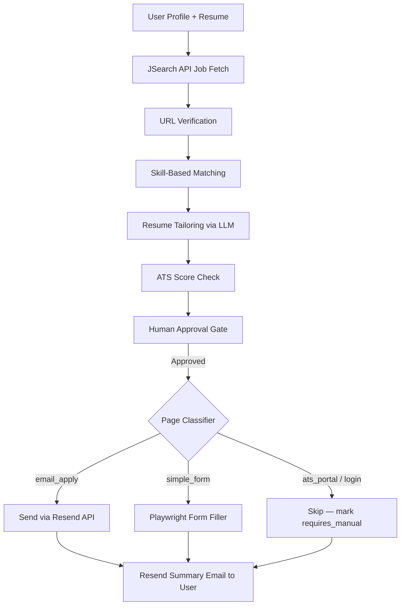

# Job Agent Orchestrator

An AI-powered job application pipeline that searches for real jobs, tailors your resume, verifies apply links, and submits applications — with email confirmation via Resend.

---

## Prerequisites

| Tool | Version | Notes |
|---|---|---|
| Python | 3.12+ | Backend runtime |
| Node.js | 22+ | Frontend runtime |
| pip | latest | `python -m pip install --upgrade pip` |

---

## Quick Start

### 1. Clone and configure

```bash
git clone <repo-url>
cd job-agent-orchestrator
```

Copy the example env file:

```bash
cp backend/.env.example backend/.env
```

**All keys are optional.** With **zero keys** the app already runs end-to-end and
does a **real web search** for jobs across free public job boards (Remotive,
Arbeitnow, RemoteOK) — no API key required. Resume tailoring falls back to a
deterministic (non-LLM) output and applications are recorded locally. Add keys to
`backend/.env` to turn on live AI features, then restart the backend:

```env
# Live resume tailoring — set at least ONE (empty = deterministic fallback).
# Dropping in ONLY OpenAI or Grok works even with the Anthropic default below —
# the app auto-selects a matching model from whichever key you provide.
OPENAI_API_KEY=sk-...
GROK_API_KEY=xai-...
ANTHROPIC_API_KEY=sk-ant-...

# Default model shown in the UI. Auto-overridden to match your configured key.
LLM_DEFAULT_MODEL=claude-3-5-sonnet

# OPTIONAL: JSearch (Google for Jobs) for precise location filtering. Empty =
# free keyless web search across public job boards (the default).
JSEARCH_API_KEY=...                  # https://rapidapi.com/letscrape-6bRBa3QguO5/api/jsearch

# Email notifications + HR email applications. Empty = notifications skipped.
RESEND_API_KEY=re_xxxxxxxxxx         # https://resend.com/api-keys

# simulate = record applications locally (default, safe). live = real Playwright
# auto-apply (email + simple forms; ATS/login/CAPTCHA pages are skipped).
AUTO_APPLY_MODE=simulate
```

The landing page shows a **Demo mode / Live mode** banner: job search is always
live; the banner reflects whether AI resume tailoring and the other features are
active based on the keys you set.

### Job search & applying

| Capability | No key | With key |
|---|---|---|
| **Job search** | Real web search (Remotive + Arbeitnow + RemoteOK) | JSearch / Google for Jobs (`JSEARCH_API_KEY`) for precise locations |
| **Resume tailoring** | Deterministic, truth-preserving | Live LLM via OpenAI / Grok / Anthropic |
| **Applying** | Recorded locally (`AUTO_APPLY_MODE=simulate`) | Real Playwright auto-apply (`AUTO_APPLY_MODE=live`): emails HR for email-apply pages, fills simple forms; ATS/login/CAPTCHA pages are safely skipped |

### 2. Backend

```bash
cd backend

# Create and activate virtual environment (first time only)
python -m venv .venv

# Windows
.venv\Scripts\activate
# macOS / Linux
source .venv/bin/activate

# Install dependencies
pip install -r requirements.txt

# Install Playwright browser (required for auto-apply form filling)
playwright install chromium

# Start the API server
uvicorn app.main:app --reload --port 8000
```

The backend runs at **http://localhost:8000**  
Interactive API docs: **http://localhost:8000/docs**

### 3. Frontend

```bash
cd frontend
npm install
npm run dev
```

The app runs at **http://localhost:3000**

---

## How to Use

1. **Open** `http://localhost:3000`
2. **Fill in** your name, email, phone, location (US, Canada, Europe, or Middle East), target job title, and upload your resume
3. **Search** — live JSearch listings when a key is set, otherwise region-aware demo jobs
4. **Review** matched jobs — each card shows a URL verification badge (✓ Verified / 🔒 Login required)
5. **Select** the jobs you want to apply to (or click "Select all")
6. **Prepare → Tailor → Approve → Submit** using the workspace controls
7. **Check your email** — a styled summary arrives via Resend after submission

---

## Pipeline Flow



---

## Key Services

| Service | File | Description |
|---|---|---|
| Job search | `services/job_search/service.py` | JSearch API, variant expansion, deduplication |
| URL verification | `services/job_search/url_verifier.py` | HEAD request validation of apply links |
| Skill extraction | `services/job_search/skill_extractor.py` | ~200 skill keyword dictionary |
| Matching | `services/matching/service.py` | Weighted skill/title/location scoring |
| Resume tailoring | `services/resume_agent/service.py` | LLM gateway (OpenAI / Claude / Grok) |
| Auto-apply | `services/auto_apply/service.py` | Page classifier → email or form handler |
| Email (HR) | `services/auto_apply/email_applicant.py` | Send resume to HR via Resend |
| Email (user) | `services/notifications/service.py` | Application summary via Resend |

---

## Email Setup (Resend)

All email goes through **Resend** — no SMTP configuration needed.

| Use case | What it does |
|---|---|
| User notification | Styled summary email after each submission batch |
| HR application | Sends cover letter + resume PDF attachment to HR email (email_apply pages only) |

**Sandbox mode** (default, no domain required):  
The `onboarding@resend.dev` sender works immediately but can only deliver to the email address you registered with at resend.com. Good for testing.

**Production mode** (verify your domain):  
Go to [resend.com/domains](https://resend.com/domains), add a DNS TXT record, then set:
```env
RESEND_FROM_EMAIL=Job Agent <noreply@yourdomain.com>
```

---

## API Budget Guide

Free tiers — how far they go per month:

| API | Free Limit | Typical Usage |
|---|---|---|
| JSearch (RapidAPI) | 200 requests/month | ~50–100 user searches |
| Resend | 3,000 emails/month | 3,000 application summaries |
| OpenAI / Claude / Grok | Varies by plan | ~100–500 resume tailoring calls |

Each user search uses **2–4 JSearch API calls** (primary + country variant).

---

## Running with Docker

```bash
# Build and start both backend and frontend
docker compose up --build

# Backend: http://localhost:8000
# Frontend: http://localhost:3000
```

> **Note:** The Docker compose file reads from `backend/.env.example`. For production, mount your real `.env` instead.

---

## Project Structure

```
job-agent-orchestrator/
├── backend/
│   ├── app/
│   │   ├── agents/          # Thin agent wrappers (job, match, resume, apply)
│   │   ├── api/v1/          # FastAPI route files
│   │   ├── core/            # Settings, config validation
│   │   ├── db/              # SQLAlchemy models + session
│   │   ├── schemas/         # Pydantic v2 request/response schemas
│   │   └── services/        # All business logic by domain
│   │       ├── auto_apply/      # Page classifier, form filler, email sender
│   │       ├── job_search/      # JSearch adapter, URL verifier, skill extractor
│   │       ├── matching/        # Weighted similarity scoring
│   │       ├── notifications/   # Resend summary emails
│   │       └── resume_agent/    # LLM resume tailoring
│   ├── requirements.txt
│   └── .env.example
├── frontend/
│   ├── app/                 # Next.js App Router pages
│   ├── components/          # PipelineDashboard, SearchWorkspace, etc.
│   └── lib/api.ts           # HTTP contract layer
├── docker-compose.yml
└── AGENTS.md                # Coding agent rules and architecture guide
```

---

## Extended Docs

- `AGENTS.md` — architecture rules, agent design, coding conventions
- `PRD.md` — product requirements and feature roadmap
- `SKILL.md` — developer onboarding guide
- `docs/BACKEND.md` — backend deep-dive
- `docs/FRONTEND.md` — frontend component guide
