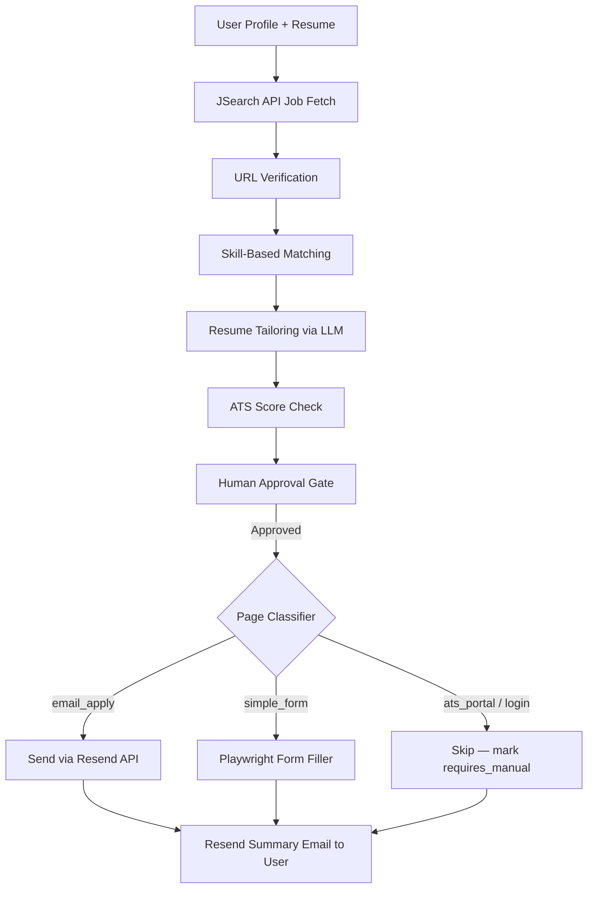

# Job Agent Orchestrator

An AI-powered job application pipeline that searches for real jobs, tailors your resume, verifies apply links, and submits applications — with email confirmation via Resend.

---

## Prerequisites

| Tool | Version | Notes |
|---|---|---|
| Python | 3.12+ | Backend runtime |
| Node.js | 22+ | Frontend runtime |
| pip | latest | `python -m pip install --upgrade pip` |

---

## Run it manually

You need **two terminals** — one for the backend API, one for the frontend.
The app runs with **zero API keys** out of the box (see [API keys](#api-keys--which-ones-matter) to unlock live features).

### One-time setup

**Backend** (from the repo root):

```bash
cd backend
python -m venv .venv

# Activate the virtual environment:
.venv\Scripts\activate         # Windows (PowerShell / CMD)
source .venv/bin/activate      # macOS / Linux

pip install -r requirements.txt
playwright install chromium    # only needed for AUTO_APPLY_MODE=live

# Create your env file (safe defaults; every key is optional):
copy .env.example .env         # Windows
cp   .env.example .env         # macOS / Linux
```

**Frontend** (from the repo root, in a second terminal):

```bash
cd frontend
npm install
```

### Every run

**Terminal 1 — backend:**

```bash
cd backend
.venv\Scripts\activate         # Windows  (source .venv/bin/activate on macOS/Linux)
uvicorn app.main:app --reload --port 8000
```

Backend → **http://localhost:8000**  ·  Interactive API docs → **http://localhost:8000/docs**

**Terminal 2 — frontend:**

```bash
cd frontend
npm run dev
```

App → **http://localhost:3000**

> **After editing `backend/.env`, restart the backend** for changes to take effect.
> If you get `address already in use` on port 8000, an old server is still running —
> stop it, or start on another port with `--port 8001` (then set
> `NEXT_PUBLIC_API_BASE_URL=http://localhost:8001` for the frontend).

---

## API keys — which ones matter

Copy `backend/.env.example` to `backend/.env` and fill in **only what you need**.
The app is fully usable with **no keys** (real web-searched jobs + deterministic
resume tailoring + locally-recorded applications). Each key below unlocks a live
feature:

| Key | Priority | What it unlocks | Get it |
|---|---|---|---|
| `OPENAI_API_KEY` **or** `GROK_API_KEY` **or** `ANTHROPIC_API_KEY` | **Most important** | **Live AI resume tailoring.** Set any **one**. Without it, tailoring uses a deterministic (non-LLM) fallback. | [OpenAI](https://platform.openai.com/api-keys) · [xAI / Grok](https://console.x.ai) · [Anthropic](https://console.anthropic.com) |
| `RESEND_API_KEY` | Recommended | **Email notifications** (application summary emailed to you) and **HR email applications** in live apply mode. Without it, email is skipped. | [resend.com/api-keys](https://resend.com/api-keys) |
| `JSEARCH_API_KEY` | Optional | **Google-for-Jobs listings** with precise location/country filtering. Without it, the app web-searches free public boards (Remotive, Arbeitnow, RemoteOK). | [RapidAPI JSearch](https://rapidapi.com/letscrape-6bRBa3QguO5/api/jsearch) |

**Two settings (not keys) control behavior:**

| Setting | Default | Meaning |
|---|---|---|
| `LLM_DEFAULT_MODEL` | `claude-3-5-sonnet` | Model shown in the UI. **You usually don't need to change this** — if it names a provider you didn't key, the app auto-selects a working model from whichever key you set (so dropping in *only* OpenAI or Grok just works). Options: `gpt-4o-mini`, `gpt-4.1-mini`, `grok-3-mini`, `grok-3`, `claude-3-5-sonnet`, `claude-3-7-sonnet`. |
| `AUTO_APPLY_MODE` | `simulate` | `simulate` records applications locally (safe default). `live` performs real Playwright auto-apply: emails HR for email-apply pages and fills simple forms; ATS/login/CAPTCHA pages are skipped. |

> **Fastest path to full functionality:** set **one** LLM key (OpenAI *or* Grok) plus
> `RESEND_API_KEY`, leave everything else at its default, and restart the backend.

The landing page shows a **Demo mode / Live mode** banner reflecting exactly what's
active based on your keys. Job search is always live.

### What works with no key vs. with keys

| Capability | No key | With key |
|---|---|---|
| **Job search** | Real web search (Remotive + Arbeitnow + RemoteOK) | JSearch / Google for Jobs (`JSEARCH_API_KEY`) for precise locations |
| **Resume tailoring** | Deterministic, truth-preserving | Live LLM via OpenAI / Grok / Anthropic |
| **Applying** | Recorded locally (`AUTO_APPLY_MODE=simulate`) | Real Playwright auto-apply (`AUTO_APPLY_MODE=live`): emails HR for email-apply pages, fills simple forms; ATS/login/CAPTCHA pages are safely skipped |

---

## How to Use

1. **Open** `http://localhost:3000`
2. **Fill in** your name, email, phone, location (US, Canada, Europe, or Middle East), target job title, and upload your resume
3. **Search** — real jobs from a live web search across public boards (or JSearch/Google for Jobs when `JSEARCH_API_KEY` is set)
4. **Review** matched jobs — each card shows a URL verification badge (✓ Verified / 🔒 Login required)
5. **Select** the jobs you want to apply to (or click "Select all")
6. **Prepare → Tailor → Approve → Submit** using the workspace controls
7. **Check your email** — a styled summary arrives via Resend after submission

---

## Pipeline Flow



---

## Key Services

| Service | File | Description |
|---|---|---|
| Job search | `services/job_search/service.py` | JSearch API, variant expansion, deduplication |
| URL verification | `services/job_search/url_verifier.py` | HEAD request validation of apply links |
| Skill extraction | `services/job_search/skill_extractor.py` | ~200 skill keyword dictionary |
| Matching | `services/matching/service.py` | Weighted skill/title/location scoring |
| Resume tailoring | `services/resume_agent/service.py` | LLM gateway (OpenAI / Claude / Grok) |
| Auto-apply | `services/auto_apply/service.py` | Page classifier → email or form handler |
| Email (HR) | `services/auto_apply/email_applicant.py` | Send resume to HR via Resend |
| Email (user) | `services/notifications/service.py` | Application summary via Resend |

---

## Email Setup (Resend)

All email goes through **Resend** — no SMTP configuration needed.

| Use case | What it does |
|---|---|
| User notification | Styled summary email after each submission batch |
| HR application | Sends cover letter + resume PDF attachment to HR email (email_apply pages only) |

**Sandbox mode** (default, no domain required):  
The `onboarding@resend.dev` sender works immediately but can only deliver to the email address you registered with at resend.com. Good for testing.

**Production mode** (verify your domain):  
Go to [resend.com/domains](https://resend.com/domains), add a DNS TXT record, then set:
```env
RESEND_FROM_EMAIL=Job Agent <noreply@yourdomain.com>
```

---

## API Budget Guide

Free tiers — how far they go per month:

| API | Free Limit | Typical Usage |
|---|---|---|
| JSearch (RapidAPI) | 200 requests/month | ~50–100 user searches |
| Resend | 3,000 emails/month | 3,000 application summaries |
| OpenAI / Claude / Grok | Varies by plan | ~100–500 resume tailoring calls |

Each user search uses **2–4 JSearch API calls** (primary + country variant).

---

## Running with Docker

```bash
# Build and start both backend and frontend
docker compose up --build

# Backend: http://localhost:8000
# Frontend: http://localhost:3000
```

> **Note:** The Docker compose file reads from `backend/.env.example`. For production, mount your real `.env` instead.

---

## Project Structure

```
job-agent-orchestrator/
├── backend/
│   ├── app/
│   │   ├── agents/          # Thin agent wrappers (job, match, resume, apply)
│   │   ├── api/v1/          # FastAPI route files
│   │   ├── core/            # Settings, config validation
│   │   ├── db/              # SQLAlchemy models + session
│   │   ├── schemas/         # Pydantic v2 request/response schemas
│   │   └── services/        # All business logic by domain
│   │       ├── auto_apply/      # Page classifier, form filler, email sender
│   │       ├── job_search/      # JSearch adapter, URL verifier, skill extractor
│   │       ├── matching/        # Weighted similarity scoring
│   │       ├── notifications/   # Resend summary emails
│   │       └── resume_agent/    # LLM resume tailoring
│   ├── requirements.txt
│   └── .env.example
├── frontend/
│   ├── app/                 # Next.js App Router pages
│   ├── components/          # PipelineDashboard, SearchWorkspace, etc.
│   └── lib/api.ts           # HTTP contract layer
├── docker-compose.yml
└── AGENTS.md                # Coding agent rules and architecture guide
```

---

## Extended Docs

- `AGENTS.md` — architecture rules, agent design, coding conventions
- `PRD.md` — product requirements and feature roadmap
- `SKILL.md` — developer onboarding guide
- `docs/BACKEND.md` — backend deep-dive
- `docs/FRONTEND.md` — frontend component guide
